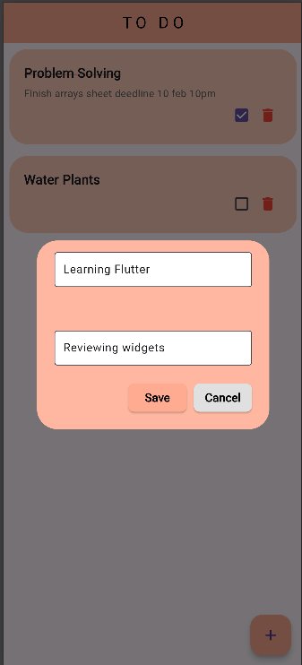
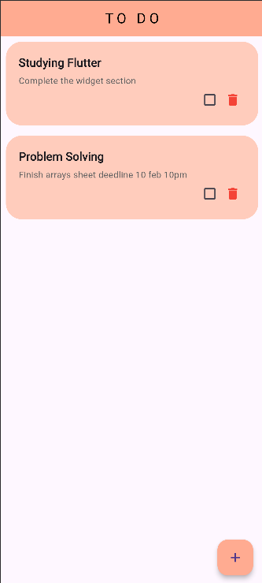
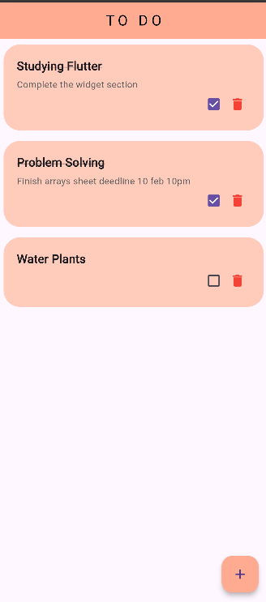
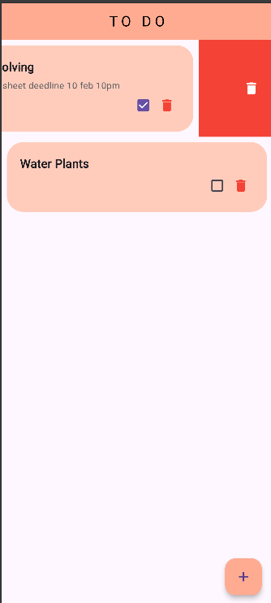

# 🌟 Flutter ToDo App 🌟

Welcome to the Flutter ToDo App – your ultimate task management companion! This app helps you stay organized, productive, and stress-free. Whether you're managing daily chores, work tasks, or personal goals, this app has got you covered.

## 🚀 Why Choose This App?

- **🎯 Simple & Intuitive:** Add, complete, and delete tasks with just a few taps.
- **🎨 Beautiful Design:** A clean, modern, and visually appealing interface.
- **🛠️ Efficient Workflow:** Swipe to delete, checkboxes to complete, and a quick-add feature for seamless task management.
- **📱 Cross-Platform:** Works flawlessly on Android, iOS, and web.

## 🚀 Features

- **✅ Add Tasks:** Quickly add new tasks with a sleek dialog box.
- **✔️ Complete Tasks:** Mark tasks as done with a satisfying checkbox.
- **🗑️ Delete Tasks:** Swipe away tasks or delete them with a button.
- **🎨 Responsive Design:** Looks great on all screen sizes.

## 🛠️ Tech Stack

- **Flutter:** For building a beautiful, cross-platform app.
- **Material Design:** For a consistent and polished UI.
- **State Management:** Built-in setState for smooth task updates.

## 📂 Sneak Peek

<p><strong>Add Task</strong><br>
</p>

<p><strong>Task List</strong><br>
</p>

<p><strong>Completed Task</strong><br>
</p>

<p><strong>Removing Task</strong><br>
</p>


## 🚀 Getting Started

To get started with this project, follow these steps:

1. **Clone the repository:**
   ```bash
   git clone https://github.com/your-username/flutter-todo-app.git
   ```

2. **Navigate to the project:**
   ```bash
   cd flutter-todo-app
   ```

3. **Install dependencies:**
   ```bash
   flutter pub get
   ```

4. **Run the app:**
   ```bash
   flutter run
   ```

## 📂 Project Structure

```
lib/  
├── UI/  
│   ├── addTask.png        # 🖼️ Screenshot for adding tasks  
│   ├── image.png          # 🖼️ General image used  
│   ├── makeComplete.png   # ✅ Task marked as completed  
│   ├── removeTaske.png    # 🗑️ Task removal (لاحظ الخطأ الإملائي في اسم الملف "Taske")  
│   └── taskList.png       # 📃 Screenshot of the task list  
│  
├── pages/  
│   └── utilites/          # 🛠️ Utility files  
│       ├── buttons.dart     # 🎛️ Custom buttons  
│       ├── dialog_Box.dart  # 💬 Dialog for adding tasks  
│       └── to_do_tile.dart  # 📝 Task tile widget  
│  
├── home_page.dart          # 🏠 Main screen with task list  
└── main.dart               # 🚀 App entry point  

```

## 🚀 Why I Built This

I built this app to dive deeper into Flutter and create something both functional and beautiful. Whether you're a Flutter beginner or a seasoned developer, this project is a great example of how to build a clean, efficient, and user-friendly app.

I hope it inspires you to create your own amazing projects! 🌟
